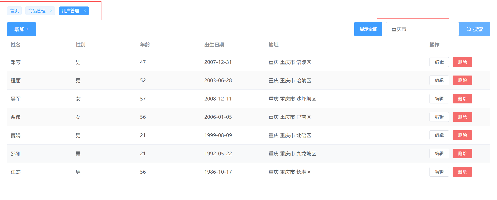

# my-back-app

## Project setup
```
npm install
```

### Compiles and hot-reloads for development
```
npm run serve
```

### Compiles and minifies for production
```
npm run build
```

### Lints and fixes files
```
npm run lint
```

### 这是一个通用后台管理项目，后续后台管理项目可在该版本进行迭代。它采用 Eelement-UI 与 Vue2 开发。后端采用 Mock 工具模拟接口数据，进行渲染前端页面。


